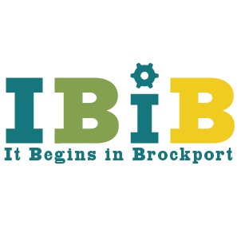

# IBIB Logos
Logos for the Makerspace, and representations across different formats.

## vector
Includes logos designed for printing, carving and web display

## terminal
Includes logos designed specifically for text terminals.

## design guidelines

### colors

* Vintage Teal (#15777d) Velspar 5010-9
* Dijon (#f0cb20) Velspar 3006-1A
* Asparagus (#83a14f) Velspar 6008-8C

### fonts

* HWT Slab Antique
