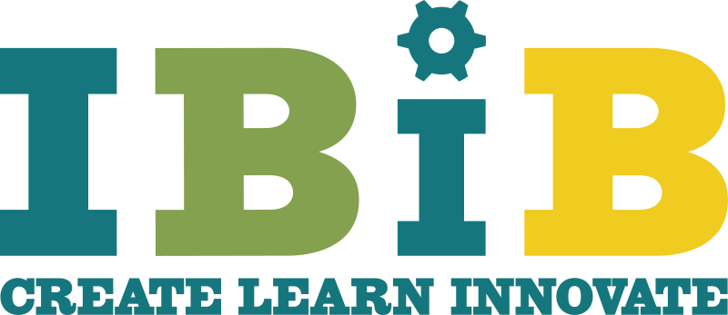
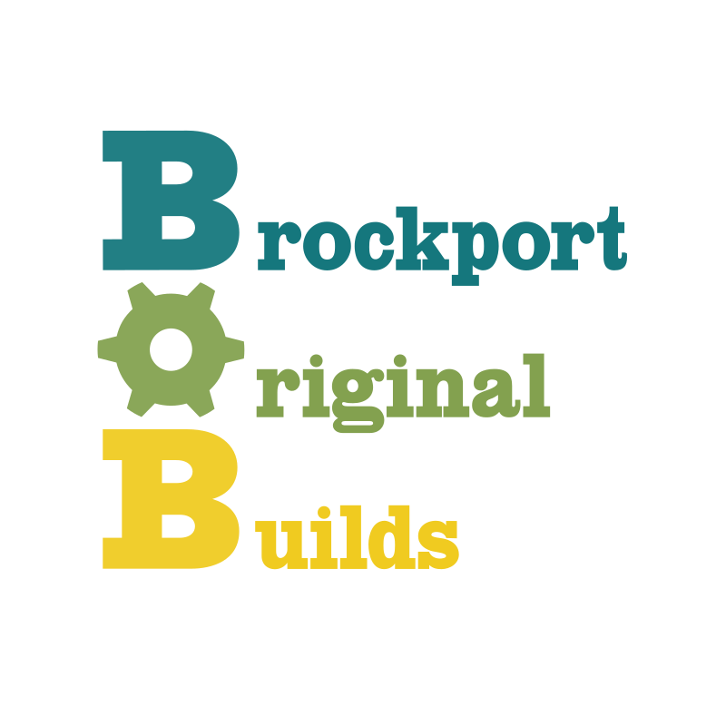
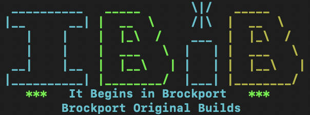

# IBIB Logos
Logos for the Makerspace, and representations across different formats.

## vector
Includes logos designed for printing, carving and web display

Our emblem/image is that of a bee 

Non-profit logo also included (Brockport Original Builds)

## terminal
Includes logos designed specifically for text terminals.

## design guidelines

### colors

*  Vintage Teal (#15777d) Velspar 5010-9 
*  Dijon (#f0cb20) Velspar 3006-1A 
*  Asparagus (#83a14f) Velspar 6008-8C 

### fonts

* HWT Slab Antique
* Rockwell bold is similar to HWT Slab Antique and is a free font.
* Additional logo design uses pain de mie and Final Six
